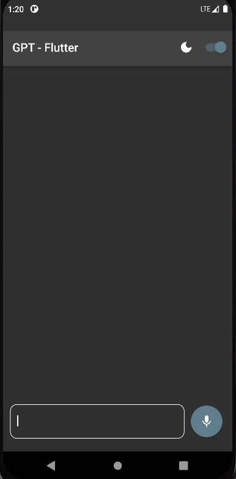

# GPT- Flutter
Flutter app which uses openAI API to interect with user and answer their queries. This application has ability to use voice command so that user will able to chat without typing.
 
## Getting Started
-----
Testing video - [Click to picture](https://drive.google.com/file/d/1X3D-X5B-VwpjQfa8bjxDnmTvccsAhOQy/view?usp=sharing) 
-----

----
Drive app link - [Click Here](https://drive.google.com/file/d/1repVRD-4fPaR5iLIXmm5nYqI0ys83fVL/view?usp=sharing)
----

----
Download using github
----
[Application arm64](./App_and_Video/app-arm64-v8a-release.apk)
[Application armeabi](./App_and_Video/app-armeabi-v7a-release.apk)
[Application x86](./App_and_Video/app-x86_64-release.apk)

## 🛠️🛠️
